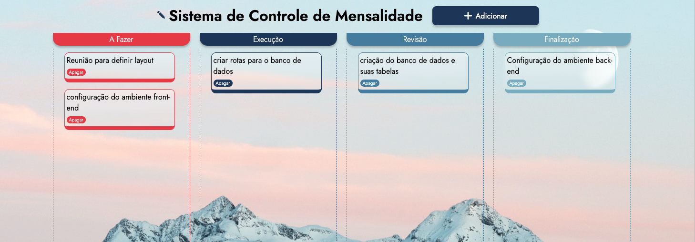

# Lista de tarefa
Projeto elaborado em pareceria com o <a href="https://github.com/Phtessarolo" target="_blank">Pedro Tessarolo</a> para aprimorar os conhecimentos adquiridos em HTML, CSS e JS durante a nossa participação no Bootcamp da DB1. 

<h2>Kanban - O que é ?</h2>
No modelo de Kanban, uma lista de tarefas é uma representação visual das atividades que precisam ser realizadas em um determinado projeto ou processo. É uma ferramenta fundamental para ajudar as equipes a organizar, priorizar e acompanhar o progresso das tarefas em um quadro Kanban.

<h2>Como acessar ?</h2>
O projeto pode ser acessado pelo link <a href="https://" target="_blank">TalsList--Kanban</a>. Todas as interações ficaram salvas na memória do navegador. 

<h2>Funcionalidades</h2>
<ul>
  <li>Drag and Drop</li>
  <li>LocalStorage</li>
  <li>JavaScript DOM</li>
</ul>